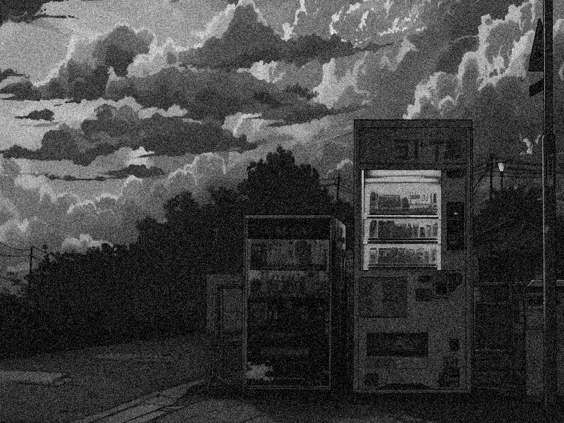

# noise2normal
Denoising Images using Central Limit Theorem


A tiny, practical demo of the Central Limit Theorem applied to images.
We generate multiple noisy versions of the same image and average them to recover a cleaner result.

It shows that regardless of the noise distribution you start with (uniform, skewed, or already Gaussian), the sample mean of independent noise terms trends toward a Gaussian around the true mean, with variance shrinking like 1/n.
In code here we use Gaussian noise by default, but the averaging logic and takeaway generalize.

## Build
```bash
g++ -std=c++14 main.cpp -o noise2normal $(pkg-config --cflags --libs opencv4)
```

## Run
```bash
./noise2normal -i <image_path> [--sample-size N] [--show-random-noisy-image]
```

## Args:
- `-i, --image <path>` input image path (required)
- `--sample-size N` number of noisy samples to generate and average, default 5
- `--show-random-noisy-image` also show one random noisy sample window

## Example
```bash
./noise2normal -i sample.png --sample-size 1000 --show-random-noisy-image
```

| Noisy sample | After CLT (N=1000) |
| --- | --- |
|  |  |
